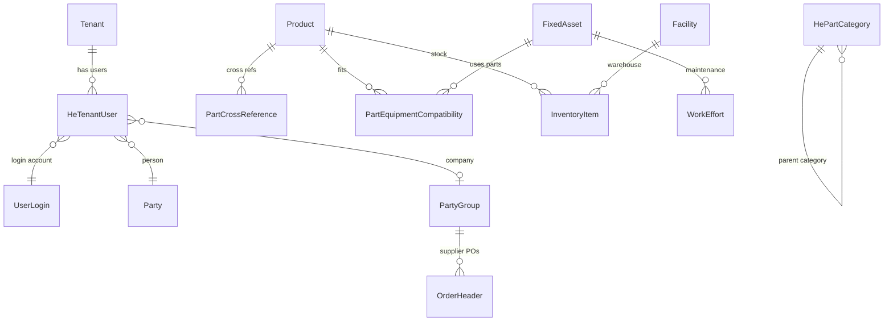

# Heavy Equipment & Fleet Parts Inventory Platform

> Multi-tenant parts inventory platform for heavy equipment, fleet, and maintenance — built on **Apache OFBiz 24.09.07** + **React (Vite)**.

Use this README for **demos, onboarding, and presentations**. It explains what was built, how it works, and how to run it.

---

## Table of Contents

1. [Executive Summary](#1-executive-summary)
2. [Golden Rule — No OFBiz Core Changes](#2-golden-rule--no-ofbiz-core-changes)
3. [How This Plugin Was Created](#3-how-this-plugin-was-created)
4. [Architecture](#4-architecture)
5. [Database — Custom Tables & Relationships](#5-database--custom-tables--relationships)
6. [Git Setup — Track Only Your Changes](#6-git-setup--track-only-your-changes)
7. [Prerequisites & Build / Run](#7-prerequisites--build--run)
8. [URLs — Frontend, Swagger, APIs](#8-urls--frontend-swagger-apis)
9. [Login & Tenant Onboarding](#9-login--tenant-onboarding)
10. [Frontend (React) Overview](#10-frontend-react-overview)
11. [Backend API Overview](#11-backend-api-overview)
12. [Security & Roles](#12-security--roles)
13. [Demo Data Loaded](#13-demo-data-loaded)
14. [Presentation Cheat Sheet](#14-presentation-cheat-sheet)
15. [Troubleshooting](#15-troubleshooting)

---

## 1. Executive Summary

| Layer | Technology | Location |
|-------|------------|----------|
| **Backend** | Apache OFBiz Entity Engine + Service Engine + Groovy REST APIs | `plugins/heavyequipment/` |
| **Frontend** | React 18 + TypeScript + Vite | `plugins/heavyequipment/vite-react-app/` |
| **Database** | Derby (default) or PostgreSQL | OFBiz `runtime/data/` |
| **API Docs** | OpenAPI 3 + Swagger UI | `/heavyequipment/openapi.json` |

**What it does today (MVP):**

- Platform Admin creates tenants and tenant admin users
- Tenant users login and use: Dashboard, Parts, Equipment, Inventory, POs, Suppliers, Work Orders
- Parts cross-reference (OEM / alternate / superseded numbers)
- Part ↔ Equipment compatibility mapping
- JSON REST APIs for all modules

---

## 2. Golden Rule — No OFBiz Core Changes

As a senior OFBiz architect, **all custom code stays inside the plugin**. We do **not** edit:

| Do NOT touch | Why |
|--------------|-----|
| `framework/` | OFBiz kernel — upgrades would break |
| `applications/` | Standard ERP modules (catalog, order, etc.) |
| Other plugins | Isolation |

**Everything we built lives here:**

```
plugins/heavyequipment/
├── ofbiz-component.xml       ← registers entities, data, webapp
├── entitydef/entitymodel.xml ← 4 custom DB tables
├── groovyScripts/api/        ← REST API layer (14 scripts)
├── data/                     ← permissions, demo data
├── webapp/heavyequipment/    ← controller.xml, OpenAPI, deployed React
├── vite-react-app/           ← React source (dev)
└── widget/                   ← OFBiz screen shell for React
```

**Only exception (1 file outside plugin):**

| File | Change |
|------|--------|
| `plugins/rest-api/webapp/docs/swagger-ui.html` | Added dropdown entry for our OpenAPI spec |

OFBiz auto-discovers plugins in `plugins/` folder — no `component-load.xml` edit needed.

---

## 3. How This Plugin Was Created

### Step 1 — Create empty plugin scaffold (OFBiz command)

From OFBiz root directory:

```powershell
cd apache-ofbiz-24.09.07

# Official OFBiz Gradle task — creates plugin folder + ofbiz-component.xml template
gradlew createPlugin -PpluginId=heavyequipment
```

Optional parameters (from OFBiz docs):

```powershell
gradlew createPlugin -PpluginId=heavyequipment `
  -PpluginResourceName=HeavyEquipment `
  -PwebappName=heavyequipment `
  -PbasePermission=HEAVYEQUIPMENT
```

This creates `plugins/heavyequipment/` with standard OFBiz structure.

### Step 2 — Register component resources

Edit `ofbiz-component.xml` to add:

- Entity model (`entitydef/entitymodel.xml`)
- Seed/demo data XML files
- Webapp mount at `/heavyequipment`
- Service definitions (optional)

### Step 3 — Add custom entities

Define new tables in `entitydef/entitymodel.xml`. OFBiz auto-creates tables on startup.

### Step 4 — Add Groovy API + controller routes

1. Create script: `groovyScripts/api/YourAPI.groovy`
2. Map URI in `webapp/heavyequipment/WEB-INF/controller.xml`

### Step 5 — Add React frontend

```powershell
cd plugins/heavyequipment/vite-react-app
npm create vite@latest . -- --template react-ts
npm install
npm run dev
```

Vite proxies API calls to `https://localhost:8443`.

### Step 6 — Load data & start

```powershell
gradlew loadAll    # loads seed + demo data including our plugin
gradlew ofbiz      # start server
```

---

## 4. Architecture

### High-level diagram

```
┌─────────────────────────────────────────────────────────────────┐
│  Browser                                                        │
│  ┌───────────────────────────────────────────────────────────┐  │
│  │  React SPA (Vite)                                         │  │
│  │  • Platform Admin  →  Tenant onboarding                   │  │
│  │  • Tenant Portal   →  Parts, Inventory, Equipment, POs    │  │
│  └─────────────────────────┬─────────────────────────────────┘  │
│                            │ JSON REST + session cookie         │
└────────────────────────────┼────────────────────────────────────┘
                             ▼
┌─────────────────────────────────────────────────────────────────┐
│  Apache OFBiz  (https://localhost:8443)                         │
│                                                                 │
│  controller.xml  →  Groovy API scripts  →  Service Engine       │
│                                              ↓                  │
│                                         Entity Engine           │
│                                              ↓                  │
│                                    Derby / PostgreSQL           │
└─────────────────────────────────────────────────────────────────┘
```

### Request flow (example: login)

```
POST /heavyequipment/control/api/login
  → AuthAPI.groovy
    → userLogin service (password check)
    → HE_* role check
    → LoginWorker.doBasicLogin (session cookie)
    → HeTenantUser lookup (tenantId, tenantName)
  ← JSON { success, userLoginId, tenantId, roles, ... }
```

### Multi-tenant model

```
Platform Admin (admin / FULLADMIN)
    │
    ├── Creates Tenant (Tenant entity)
    ├── Creates PartyGroup (company)
    ├── Creates UserLogin + HE_TENANT_ADMIN role
    └── Links via HeTenantUser table
            │
            └── Tenant Admin logs in → sees tenant portal only
```

---

## 5. Database — Custom Tables & Relationships

We added **4 custom entities**. Everything else uses standard OFBiz entities.

### Custom tables (our plugin)

| Entity | Table purpose | Primary key |
|--------|---------------|-------------|
| **PartCrossReference** | OEM / manufacturer / supplier / alternate part numbers | `crossRefId` |
| **HePartCategory** | Heavy-equipment part categories (Filters, Hydraulic, etc.) | `heCategoryId` |
| **PartEquipmentCompatibility** | Which part fits which equipment | `productId` + `fixedAssetId` + `fromDate` |
| **HeTenantUser** | Links tenant ↔ user login ↔ company party | `heTenantUserId` |

### Standard OFBiz entities we reuse

| OFBiz entity | Business meaning in our app |
|--------------|----------------------------|
| `Product` | Parts master |
| `FixedAsset` | Equipment / fleet assets |
| `Facility` | Warehouses |
| `InventoryItem` | Stock on hand |
| `Party` / `PartyGroup` | Suppliers, companies |
| `OrderHeader` / `OrderItem` | Purchase orders |
| `WorkEffort` | Maintenance work orders |
| `Tenant` | Multi-tenant registry |
| `UserLogin` / `UserLoginSecurityGroup` | Authentication & roles |

### Entity relationship diagram



### HeTenantUser (multi-tenancy link table)

```
HeTenantUser
├── heTenantUserId  (PK)
├── tenantId        → Tenant.tenantId
├── userLoginId     → UserLogin.userLoginId
├── partyId         → Person.partyId
├── companyPartyId  → PartyGroup.partyId
├── roleType        (TENANT_ADMIN, INVENTORY_MGR, ...)
├── fromDate / thruDate
```

---

## 6. Git Setup — Track Only Your Changes

Parent folder `@Projects` may have other projects. **This workspace has its own focused git repo.**

### What gets committed

| Path | Description |
|------|-------------|
| `plugins/heavyequipment/**` | Full plugin (source code) |
| `docs/*.md` | PRD, implementation strategy |
| `plugins/rest-api/.../swagger-ui.html` | Swagger dropdown (1 file) |

### What is ignored

- Entire OFBiz core (`framework/`, `applications/`, `runtime/`, `build/`)
- `node_modules/`
- Compiled React assets (`webapp/.../assets/` — rebuild with `npm run build`)

### Commands

```powershell
cd "d:\@Projects\apache-ofbiz-24.09.07 (2)"

git init
git add .
git status          # ← only YOUR files appear
git commit -m "Heavy Equipment plugin MVP"
```

Root `.gitignore` uses a **whitelist pattern** — ignore everything, then un-ignore only our paths.

---

## 7. Prerequisites & Build / Run

### Prerequisites

| Tool | Version |
|------|---------|
| Java JDK | 17+ |
| Node.js | 18+ |
| Git | Latest |

### First-time setup

```powershell
# 1. OFBiz root
cd "d:\@Projects\apache-ofbiz-24.09.07 (2)\apache-ofbiz-24.09.07"

# Load seed + demo data (includes our plugin demo data)
gradlew loadAll

# 2. React dependencies
cd plugins\heavyequipment\vite-react-app
npm install
```

### Daily development (2 terminals)

**Terminal 1 — Backend:**

```powershell
cd apache-ofbiz-24.09.07
gradlew ofbiz
# Wait for: "Started Jetty Server"
```

**Terminal 2 — Frontend (hot reload):**

```powershell
cd apache-ofbiz-24.09.07\plugins\heavyequipment\vite-react-app
npm run dev
```

### Production build (serve React from OFBiz)

```powershell
cd plugins\heavyequipment\vite-react-app
npm run build
# Output → webapp/heavyequipment/vite-react-app/

cd ..\..\..   # back to OFBiz root
gradlew ofbiz
# Access: https://localhost:8443/heavyequipment/control/app
```

---

## 8. URLs — Frontend, Swagger, APIs

| URL | Purpose |
|-----|---------|
| **http://localhost:5173/heavyequipment/vite-react-app/#/login** | React app (development) |
| **https://localhost:8443/heavyequipment/control/app** | React app (production build) |
| **https://localhost:8443/docs/swagger-ui.html** | Swagger UI (select **Heavy Equipment Inventory Platform**) |
| **https://localhost:8443/heavyequipment/openapi.json** | Our OpenAPI 3 spec (direct) |
| **https://localhost:8443/heavyequipment/control/api/** | REST API base path |
| **https://localhost:8443/webtools/control/main** | OFBiz WebTools (entity admin) |

### Swagger

Open Swagger → dropdown top-left → **"Heavy Equipment Inventory Platform"**

Documents all endpoints: login, session, parts, cross-ref, equipment, inventory, suppliers, POs, work orders, tenants.

---

## 9. Login & Tenant Onboarding

### Default credentials

| User | Password | Role | Goes to |
|------|----------|------|---------|
| `admin` | `ofbiz` | Platform Admin (FULLADMIN) | `#/platform/tenants` |
| `devfleet_admin` | `ofbiz` | Demo Tenant Admin | `#/tenant/dashboard` |

### Create new tenant (Platform Admin)

1. Login as `admin` / `ofbiz`
2. Go to **Platform → Tenants**
3. Fill: Tenant ID, Company Name, Admin username, password
4. Click **Provision Tenant**
5. Copy credentials from success panel
6. Logout → login as tenant admin

### Tenant login flow (fixed)

Previously failed because webapp required `OFBTOOLS` permission (tenant users don't have it).

**Fix applied:**
- Removed `base-permission="OFBTOOLS"` from webapp config
- `AuthAPI.groovy` authenticates via `userLogin` service + `HE_*` role check

### Reset tenant password

Platform Admin → Tenants page → **Reset Password** section, or API:

```powershell
curl.exe -k -b cookies.txt -X POST `
  "https://localhost:8443/heavyequipment/control/api/tenants?action=resetPassword" `
  -d "tenantId=ABC_FLEET&adminUsername=abc_admin&newPassword=ofbiz"
```

---

## 10. Frontend (React) Overview

**Source:** `vite-react-app/src/`

### Tech stack

- React 18 + TypeScript
- React Router (HashRouter)
- Vite dev server with proxy to OFBiz
- Custom CSS design system (`styles/variables.css`, `layout.css`)

### Routes

| Route | Page | Who |
|-------|------|-----|
| `/login` | Login | Everyone |
| `/platform/tenants` | Tenant onboarding & list | Platform Admin |
| `/tenant/dashboard` | Overview stats | Tenant users |
| `/tenant/parts` | Parts CRUD + cross-refs | Tenant users |
| `/tenant/equipment` | Equipment list/create | Tenant users |
| `/tenant/inventory` | Warehouse QOH / ATP | Tenant users |
| `/tenant/purchase-orders` | Create PO | Tenant users |
| `/tenant/suppliers` | Supplier list | Tenant users |
| `/tenant/work-orders` | Maintenance work orders | Tenant users |

### Key files

| File | Purpose |
|------|---------|
| `src/App.tsx` | Routes + protected route guards |
| `src/context/AuthContext.tsx` | Login state, tenantId, roles |
| `src/api/client.ts` | OFBiz API fetch (`credentials: 'include'`) |
| `src/pages/platform/Tenants.tsx` | Tenant onboarding UI |
| `src/components/layout/TenantAppLayout.tsx` | Tenant sidebar shell |

### Add a new page

1. Create `src/pages/tenant/MyPage.tsx`
2. Add route in `App.tsx`
3. Add nav link in `TenantAppLayout.tsx`
4. Call API via `ofbizFetch()` from `client.ts`

---

## 11. Backend API Overview

**Base URL:** `https://localhost:8443/heavyequipment/control/api`

| Endpoint | Script | Actions |
|----------|--------|---------|
| `/api/login` | AuthAPI.groovy | POST — login |
| `/api/session` | SessionAPI.groovy | GET session / logout |
| `/api/tenants` | TenantAPI.groovy | list, create, addAdmin, resetPassword |
| `/api/parts` | PartsAPI.groovy | list, create, get, update, delete, search |
| `/api/parts/cross-ref` | PartCrossRefAPI.groovy | add, list, delete, search |
| `/api/parts/details` | PartDetails.groovy | part + compatibility |
| `/api/equipment` | EquipmentAPI.groovy | list, create |
| `/api/inventory/warehouse` | WarehouseInventory.groovy | QOH, ATP |
| `/api/inventory/receive` | GoodsReceiptAPI.groovy | goods receipt |
| `/api/suppliers` | SupplierAPI.groovy | list, create |
| `/api/purchase-orders` | PurchaseOrderAPI.groovy | create PO |
| `/api/work-orders` | WorkOrderAPI.groovy | list, create |
| `/api/compatibility` | CompatibilityAPI.groovy | add, check |

### Add new API (3 steps)

**1. Groovy script** — `groovyScripts/api/MyAPI.groovy`

**2. Route** — `webapp/heavyequipment/WEB-INF/controller.xml`:

```xml
<request-map uri="api/my-endpoint">
    <security https="false" auth="false"/>
    <event type="groovy" path="component://heavyequipment/groovyScripts/api/MyAPI.groovy"/>
    <response name="success" type="none"/>
    <response name="error" type="none"/>
</request-map>
```

**3. Document** — add to `webapp/heavyequipment/openapi.json`

---

## 12. Security & Roles

### Custom permissions

| Permission | Purpose |
|------------|---------|
| `HEAVYEQUIPMENT_VIEW` | Read access |
| `HEAVYEQUIPMENT_ADMIN` | Full plugin admin |
| `HEAVYEQUIPMENT_INVENTORY` | Inventory ops |
| `HEAVYEQUIPMENT_PROCUREMENT` | PO / suppliers |
| `HEAVYEQUIPMENT_MAINTENANCE` | Work orders |
| `HEAVYEQUIPMENT_WAREHOUSE` | Receiving / picking |
| `HEAVYEQUIPMENT_TENANT_ADMIN` | Tenant administration |

### Custom security groups

| Group | Typical user |
|-------|--------------|
| `HE_TENANT_ADMIN` | Tenant administrator |
| `HE_INVENTORY_MGR` | Inventory manager |
| `HE_WAREHOUSE_OPS` | Warehouse operator |
| `HE_PROCUREMENT` | Procurement manager |
| `HE_MAINTENANCE` | Fleet / maintenance manager |
| `HE_TECHNICIAN` | Field technician |

Platform `admin` has `FULLADMIN` → includes `HEAVYEQUIPMENT_ADMIN`.

---

## 13. Demo Data Loaded

When you run `gradlew loadAll`, these files load automatically:

| File | What it seeds |
|------|---------------|
| `HeavyEquipmentSecurityPermissionSeedData.xml` | 10 permissions |
| `HeavyEquipmentSecurityGroupDemoData.xml` | 6 role groups |
| `HeavyEquipmentDemoData.xml` | 20 parts, 5 equipment, 9 cross-refs, 17 compat links, 3 warehouses, 5 suppliers |
| `DevFleetUserDemoData.xml` | Demo tenant admin `devfleet_admin` / `ofbiz` |

---

## 14. Presentation Cheat Sheet

**30-second pitch:**

> We built a multi-tenant heavy equipment parts inventory platform on Apache OFBiz without touching core code. React frontend talks to Groovy REST APIs. Platform admin onboards tenants; tenant users manage parts, inventory, equipment, and purchase orders.

**Live demo flow (5 min):**

1. Show Swagger → `https://localhost:8443/docs/swagger-ui.html`
2. Login as `admin` → Platform Tenants → create tenant
3. Logout → login as tenant admin
4. Show Parts page (CRUD + cross-reference)
5. Show Equipment + Inventory
6. Mention architecture diagram (Section 4) and ER diagram (Section 5)

**Key talking points:**

- Headless OFBiz — Entity Engine + Service Engine as backend
- Plugin isolation — upgrade-safe
- Reuses Product, FixedAsset, OrderHeader — no reinventing ERP
- Custom entities only where OFBiz lacks domain model (cross-ref, tenant-user link)

---

## 15. Troubleshooting

| Problem | Solution |
|---------|----------|
| Tenant login 401 "Invalid username or password" | Password wrong OR old OFBTOOLS bug — pull latest AuthAPI fix; reset password from Platform Admin |
| API 404 from React | Ensure OFBiz running; check Vite proxy in `vite.config.ts` |
| Blank React page in production | Run `npm run build` in `vite-react-app/` |
| OFBiz won't start | Java 17+ required; check port 8443 not in use |
| `git status` shows too many files | Use repo at workspace root with our `.gitignore` whitelist |

---

## Related Documents

| Document | Path |
|----------|------|
| Product Requirements (PRD) | `docs/PRD.md` |
| OFBiz Implementation Strategy | `docs/OFBiz_Implementation_Strategy.md` |
| Workspace Git README | `../../README.md` (workspace root) |

---

## License

Apache License 2.0 — Built on Apache OFBiz 24.09.07
